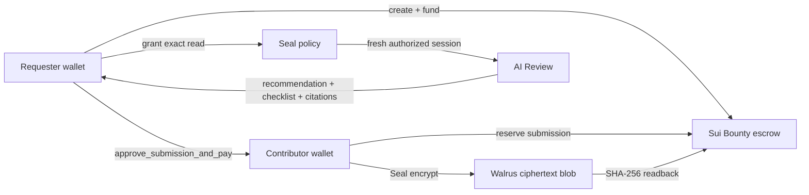

# Lighthouse by DataBounty

**Lighthouse는 조건을 공개한 뒤 암호화된 텍스트 사례를 바운티 방식으로 모집하는 Testnet MVP입니다. 요청자는 SUI를 에스크로에 예치하고, 기여자는 사례를 제출하며, AI Review가 승인·거절 권고를 반환한 뒤 요청자가 최종 지급을 승인합니다.**

**Live app:** [databounty-wine.vercel.app](https://databounty-wine.vercel.app)
**Network:** Sui Testnet
**Package:** [0xf7923bd34625af96c40e27187371f231fca6bca7d25d244fe72244ec9a89b0aa](https://suiscan.xyz/testnet/object/0xf7923bd34625af96c40e27187371f231fca6bca7d25d244fe72244ec9a89b0aa)

## Why Lighthouse

요청자는 필요한 정보의 조건을 먼저 공개하지만, 기여자는 보상 전 원문을 넓게 공개하기 어렵고 요청자는 지급 전 자료를 확인하기 어렵습니다. Lighthouse는 공개 과제, 암호화된 제출, 제한된 검토 권한, 요청자 승인 지급을 하나의 흐름으로 연결합니다.

1. **Requester**가 과제, 마감, Testnet SUI 보상을 생성합니다.
2. **Contributor**가 사례를 Seal로 암호화하고 Walrus에 저장합니다.
3. **AI Review**가 권한을 얻은 exact submission에 대해 승인·거절 권고를 반환합니다. 시스템은 필수 필드명의 포함 여부와 원문 바이트 무결성을 확인하고, 비교 대상으로 제공한 사례와 바이트 완전 일치 여부를 표시합니다.
4. **Requester**만 AI 근거를 본 뒤 payout transaction을 서명할 수 있습니다.

AI는 지급 권한이 없습니다. Sui Move가 승인된 정확한 submission의 contributor에게 escrow를 한 번만 보냅니다.

현재 MVP는 합성 피싱 사례처럼 구조화 가능한 UTF-8 `.txt`·`.md` 텍스트 제출을 다룹니다. 코드, 사고 보고서, 리서치 자료 같은 정보 자산은 자산별 템플릿과 검증 규칙을 추가하는 다음 단계의 범위입니다.

## Live verification

| Proof | Result |
| --- | --- |
| Sui package | Testnet deployment and source verification complete |
| Encrypted submission | Sui reserve → Seal encryption → Walrus publish/readback → Sui finalize complete |
| Walrus readback | Ciphertext SHA-256 matched the digest finalized on Sui |
| Seal access | Exact reviewer grant enabled a fresh decrypt; a new decrypt after payout was denied |
| AI Review | Groq `openai/gpt-oss-20b` returned `RECOMMEND_ACCEPT` with validated exact UTF-8 citation |
| Requester payout | `PAID` Bounty and `ACCEPTED` submission verified on Sui Testnet |
| Expiry refund | Separate Bounty reached `EXPIRED_REFUNDED` with zero remaining escrow |
| Separate-wallet settlement | Requester `0x3974…4af2` paid contributor `0xeefc…021e` on Testnet |

Detailed identifiers and limits are in [the live evidence packet](artifacts/evidence/SUI-WALRUS-SEAL-LIVE-PROOF.md).

## Architecture



### Sui

- Shared `Bounty` and exact `Submission` objects
- Requester-only reviewer grant, rejection, approval, cancellation, and refund
- Exact contributor binding and one-time escrow payout
- `Clock`-based deadline refund and terminal `PAID` / `EXPIRED_REFUNDED` states

### Walrus + Seal

- Walrus stores **ciphertext only**, never the plaintext contribution
- Publisher upload is followed by aggregator readback and SHA-256 verification
- Seal binds ciphertext to `BCS(bountyId, submissionId)`
- Requester, exact contributor, and time-limited requester-approved reviewer may request a fresh key
- Approval or rejection revokes reviewer access for future sessions

### AI Review

The configured server-only provider is Groq `openai/gpt-oss-20b`. It returns an approval, rejection, or human-review recommendation. It does not train on or control the escrow.

The review path checks live Sui state, reviewer grant, Walrus digest, Seal header, decrypted commitment, required field-name presence, and exact UTF-8 source-byte integrity. Optional comparison submissions are checked for byte-identical content only; semantic similarity and real-world truth are outside the current MVP.

## Security boundaries

| Property | What Lighthouse guarantees | Important limit |
| --- | --- | --- |
| Confidentiality | Plaintext is not stored on Sui or Walrus; Walrus blobs are Seal ciphertext | A legitimate recipient can retain plaintext after decrypting it |
| Integrity | Content commitment, ciphertext digest, Walrus readback, and Seal identity binding are checked | This does not prove that the real-world claim is true |
| Authorization | Exact reviewer grants have a submission scope and expiry | Reviewer access must be granted by the requester |
| Non-repudiation | Sui signatures record creation, grant, approval, payout, and refund actions | It proves chain actions, not original authorship of the material |
| Availability | Walrus distributed storage and recorded storage epoch preserve ciphertext availability | Sui RPC, Walrus, and Seal key servers remain operational dependencies |

## Testnet evidence

### Full AI Review and payout run

- Bounty: [0x040467…a2bd4](https://suiscan.xyz/testnet/object/0x040467c0954dae110f222af8ca37aa3a67b4a6160454e4a42ff38bffc8ba2bd4)
- Submission: [0xa32ff1…31af6](https://suiscan.xyz/testnet/object/0xa32ff16c3708e47511583b1548af38917a77cbc7c3bef82be7a3024fa9b31af6)
- Walrus blob: `EDoj9-ETZbZ10_wlSCTFB3Kl7py-KuDb6Qc1h9byq9c`
- Reviewer grant: [HcAvLYUU…zrtt](https://suiscan.xyz/testnet/tx/HcAvLYUU5X1p4RMHeSLSdf2HWYAip1ZE78F1C5tyzrtt)
- Payout: [9aDuBYce…YcaR](https://suiscan.xyz/testnet/tx/9aDuBYceNVdKUDLdZNcq54eCB6K6WZCLVZu18TYLYcaR)

### Separate requester/contributor settlement

- Requester: `0x3974b995fceb96dbec7247dc1e7a6c53e539c86769733e362f1b40a82cd14af2`
- Contributor: `0xeefc56c778f3877def3aa5460295cb4f1fcb89cc76f332882f0b34b7ebde021e`
- Bounty: [0x317efc…bcc255](https://suiscan.xyz/testnet/object/0x317efc01790d938434c3a484d305cc20b21a011389f2bd13830625ff29bcc255)
- Accepted payout: [73SZwma8…BhFj](https://suiscan.xyz/testnet/tx/73SZwma8mbsZ4ZK3rozBbva4CugEKEePjcyivxwCBhFj)

### Expiry refund

- Refunded Bounty: `0x0f0ce45bc348bec4e7a2cd740b79ad6c9987c9cbb90413de0bcf6a58a7b018c4`
- Refund: [ANznJg8A…KkMM](https://suiscan.xyz/testnet/tx/ANznJg8AmDmSJwrRkZyELZ4XVeM2NzrGXqidSPfpKkMM)

## Run locally

Requirements: Node.js 24+, npm 11+, a Sui Testnet wallet, and a configured reviewer delegate.

```sh
npm ci
cp .env.example .env
npm run build
npm start
```

Open `http://127.0.0.1:3000`, connect a Testnet wallet, then authenticate by signing a personal message. The signature is browser authentication, not a payment.

### Configuration

Copy `.env.example` and provide Testnet endpoints plus server-only secrets:

```dotenv
APP_ORIGIN=http://127.0.0.1:3000
COOKIE_SECRET=<server-only-random-secret>
REVIEWER_DELEGATE_PRIVATE_KEY=<server-only-reviewer-key>
AI_PROVIDER=groq
AI_BASE_URL=https://api.groq.com/openai/v1
AI_API_KEY=<server-only-api-key>
AI_MODEL=openai/gpt-oss-20b
```

Never commit `.env`, API keys, wallet private keys, Seal API keys, browser signatures, plaintext submissions, or salts. `VITE_*` settings are public browser configuration only.

## Deploy to Vercel

The production app runs its Fastify API through `api/index.mjs` and routes `/api/*` to the serverless function.

```sh
npx vercel --prod --yes
```

Set server-only configuration as Vercel production environment variables. Set public `VITE_SUI_*`, `VITE_DATABOUNTY_PACKAGE_ID`, `VITE_SEAL_*`, and `VITE_WALRUS_AGGREGATOR_URL` values for the browser bundle.

The current demo uses SQLite under Vercel `/tmp`, which is appropriate for a short-lived Demo Day session but not persistent production metadata. A production rollout should use durable managed storage and KMS-backed reviewer key management.

## Verify

```sh
npm run typecheck
npm run lint
npm test
npm run build
sui move test --path contracts
git diff --check
```

## Repository map

```text
app/        React/Vite wallet UI, browser Seal encryption, Sui transactions
server/     Fastify API, auth, Sui/Walrus/Seal/Groq boundaries
contracts/  Move Bounty, Submission lifecycle, Seal approval policy
api/        Vercel serverless entrypoint
demo/       Synthetic phishing cases for safe demonstrations
docs/       Architecture, submission material, Demo Day runbook
artifacts/  Live Testnet evidence and backup screenshots
```

## Scope

Lighthouse is a Testnet demonstration. It does not guarantee data truth, copyright ownership, legality, or real-world provenance. It makes encrypted storage, access authority, approval, and reward settlement verifiable.

## Roadmap

- **P1 — 거래 보호:** 요청자가 원문 열람을 선택한 뒤 장기간 미지급하는 상황을 막기 위한 Finalist Lock, Claim Window, 분쟁 절차
- **P1 — 자산별 제출 규칙:** 정보 자산 유형별 템플릿, 권리 보유 확인, 개인정보·금지 자료 사전 점검
- **P2 — AI 리뷰 고도화:** 승인·거절·분쟁 결과가 쌓인 뒤 자산 유형별 중복 탐지와 품질 검토 개선
