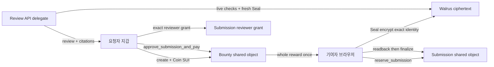

# DataBounty architecture

작성: 2026-09-14 · 상태: Luna 구현 전 동결 설계 · 기준: `GOAL-PROMPT.md`

DataBounty는 요청자가 Testnet SUI 보상을 예치하고, 기여자가 암호화한 합성 학습 사례를 제출하면, AI가 근거 있는 검수 추천을 만들고 요청자가 정확한 제출본 하나를 승인할 때만 보상을 지급하는 MVP다. AI는 검토 보조자이며 지갑·Move 지급 함수·거래 도구를 호출하지 않는다.

초기 데모는 `한국어 피싱 문자 분류 학습용 사례 1건`이다. 공개 템플릿은 `message`, `scam_type`, `red_flags`, `redacted_source_note`이며, 제출은 이 필드를 포함한 UTF-8 `.txt`/`.md` 200 KiB 이하의 합성 파일만 받는다. 한 Bounty는 최종 수상 제출 한 건, 전액 보상 한 건만 가진다. 복수 수상자, 분할 지급, 자동 지급, 평판, 라이선스·진실성 판정은 P1이다.



## New on-chain model

DataBounty uses a new `databounty` package/module. The existing `draftproof::Workspace` and `Version` types, package ID, and their evidence are historic assets only; they must never be renamed or reinterpreted as escrow state.

### Bounty shared object

| Field | Meaning |
|---|---|
| `id` | object UID |
| `requester` | sole address allowed to approve, reject, cancel, or refund |
| `reward: Balance<SUI>` | whole Testnet reward, consumed exactly once |
| `public_task_spec: vector<u8>` | immutable, public UTF-8 task/template |
| `deadline_ms` | Sui `Clock` authority |
| `state` | `OPEN`, `REVIEWING`, `PAID`, `EXPIRED_REFUNDED` |
| `submission_ids`, `ready_submission_count` | bounded IDs and cancellation guard |
| `accepted_submission_id` | empty until the one paid winner is set |

`OPEN` means no READY candidate. `REVIEWING` means one or more READY candidates. Reservations remain allowed in either state while before the deadline, so candidates can compete. Rejecting the last READY candidate returns the Bounty to OPEN. PAID and EXPIRED_REFUNDED are terminal.

### Submission shared object

| Field | Meaning |
|---|---|
| `id`, `bounty_id` | exact parent binding |
| `contributor` | sole finalizer/abandoner of the reservation |
| `content_commitment` | SHA-256 commitment of salt and content only |
| `state` | `RESERVED`, `READY`, `REJECTED`, `ACCEPTED`, `ABANDONED` |
| `blob_id`, `ciphertext_digest`, `storage_end_epoch` | immutable after READY; ciphertext metadata only |
| `reviewer_grants` | bounded exact-submission reviewer access |

`RESERVED` has no blob and never receives a Seal key. The contributor runs `reserve_submission → browser encryption → Walrus publish/readback → finalize_submission`. `ACCEPTED` is written in the same transaction as the reward payout. REJECTED and ABANDONED cannot re-enter READY.

## Fixed lifecycle and escrow invariants

| Function | Sender and preconditions | Result |
|---|---|---|
| `create_bounty(public_task_spec, deadline_ms, reward, clock)` | requester; nonempty bounded spec, future deadline, nonzero `Coin<SUI>` | share a Bounty holding the complete balance |
| `reserve_submission(bounty, content_commitment, clock)` | contributor; Bounty OPEN/REVIEWING; `now < deadline` | create exact RESERVED Submission |
| `finalize_submission(bounty, submission, blob_id, digest, epoch, clock)` | exact contributor; RESERVED; parent match; `now < deadline` | READY, increment count, Bounty REVIEWING |
| `grant/revoke_reviewer_read(bounty, submission, reviewer, expiry, clock)` | requester; exact READY/ACCEPTED Submission | alters only exact reviewer access |
| `reject_submission(bounty, submission, clock)` | requester; exact READY; Bounty nonterminal | REJECTED, revoke reviewers, no payout |
| `approve_submission_and_pay(bounty, submission, clock)` | requester; exact READY; nonterminal; `now < deadline` | ACCEPTED, revoke reviewers, Bounty PAID, transfer all escrow to contributor once |
| `cancel_open_bounty(bounty, clock)` | requester; nonterminal; `now < deadline`; ready count zero | refund and EXPIRED_REFUNDED |
| `refund_expired_bounty(bounty, clock)` | requester; nonterminal; `now >= deadline` | refund and EXPIRED_REFUNDED |
| `abandon_submission(bounty, submission, clock)` | exact contributor; RESERVED; Bounty nonterminal | ABANDONED |

Only `approve_submission_and_pay`, `cancel_open_bounty`, and `refund_expired_bounty` consume `reward`; each asserts `ctx.sender() == bounty.requester`. Approval accepts no recipient or amount argument: it converts the held balance to one `Coin<SUI>` and transfers it only to `submission.contributor`. There is no generic withdrawal, server payout route, requester private key on the server, or AI delegate payment capability.

Pre-deadline cancellation is intentionally blocked when any READY Submission exists. Deadline refund is separate and remains available to close an unapproved Bounty even if candidates remain READY.

## Exact Seal identity and plaintext binding

The encryption identity is the following fixed BCS record:

```text
SealIdentityV1 {
  bounty_id: [u8; 32],
  submission_id: [u8; 32],
}
```

`BCS(SealIdentityV1)` is exactly 64 bytes: canonical 32-byte Sui object ID bytes in that order, with no `0x` text, length prefix, or display concatenation. Browser, server, and Move need a shared golden vector and must reject a swapped, truncated, appended, or changed identity byte.

The encrypted payload is:

```text
SubmissionBundleV1 {
  format_version: u16, // 1
  bounty_id: [u8; 32],
  submission_id: [u8; 32],
  salt: [u8; 32],
  content: vector<u8>,
}
```

`content_commitment = SHA-256("databounty-content-v1" UTF-8 || salt || content)`. The submission ID is created by `reserve_submission`, so it cannot be part of the pre-reservation commitment. Exact binding therefore requires all four checks: live `submission.bounty_id`, Seal ciphertext header identity, decoded bundle IDs, and the commitment. Plaintext, salt, filename, session/key material, and AI review body are absent from chain state, SQLite, ordinary logs, Git, and screenshots.

`seal_approve(identity, bounty, submission, clock, ctx)` has no side effects. It requires exact 64-byte identity, exact parent binding, and READY/ACCEPTED state. It permits the requester, the contributor of that Submission, and a current exact reviewer grant. Reviewer grants never transfer to another Submission/Bounty and revoke on rejection or approval. Revocation blocks fresh key requests only; it cannot recall already released plaintext or keys.

## AI review boundary

The requester grants the configured reviewer delegate access to the target READY Submission and optional ACCEPTED comparison Submissions belonging to Bounties with the same requester. The server then performs: live Bounty/Submission ownership and state reads → exact grant check → Walrus readback/digest → Seal header identity → fresh delegate decrypt → bundle ID/UTF-8/commitment checks → model call → exact citation validation → live access recheck before return.

The response is ephemeral JSON:

```text
{
  recommendation: RECOMMEND_ACCEPT | RECOMMEND_REJECT | NEEDS_HUMAN_REVIEW,
  checklist: [{ field, status: PRESENT | MISSING | UNCLEAR, citationIds }],
  duplicateCandidates: [{ submissionId, verdict: NONE | POSSIBLE, citationIds }],
  citations: [{ submissionId, quote, startByte, endByte }]
}
```

Every citation must refer to a supplied Submission and equal the exact UTF-8 byte slice. Invalid/ambiguous citations, unknown fields, ungranted inputs, or model JSON outside the schema fail closed. The database stores metadata only: request ID, requester, selected IDs, status/timestamps, provider/model ID, and response hash. It stores no plaintext, prompt, review body, or recoverable result. A duplicate completed review returns `RESULT_NOT_REPLAYABLE` rather than returning a stored body.

## Migration and Luna file map

| Area | Luna-owned files | Required change |
|---|---|---|
| Move | `contracts/Move.toml`, `contracts/sources/databounty.move`, `contracts/tests/databounty_tests.move` | new escrow/lifecycle/Seal policy/events/tests; do not relabel DraftProof source |
| shared data | `server/src/api/types.ts`, `server/src/chain/types.ts`, `server/src/chain/live-sui.ts` | Bounty/Submission parsing and new state unions |
| server | `server/src/{app,config}.ts`, `server/src/ai/run-service.ts`, `server/src/seal/reader.ts`, `server/src/storage/walrus.ts`, `server/src/db/database.ts` | contributor upload auth, requester review auth, exact BCS/bundle validation, metadata-only review persistence |
| browser | `app/src/{domain,App}.tsx`, `app/src/chain/transactions.ts`, `app/src/crypto/{bcs,commitment,seal}.ts`, `app/src/storage/recovery.ts`, `app/src/api/client.ts`, `app/src/features/useDraftProof.ts` | new create/fund/submit/review/approve/reject/refund flow; ciphertext-only recovery keyed by Bounty+Submission |
| integration | `app/src/config.ts`, `.env.example`, `contracts/published.testnet.json` | require deployed `DATABOUNTY_PACKAGE_ID`; no old package fallback |

Old DraftProof DB rows/recovery records may stay archival but must not be migrated as live submissions. Publish a new DataBounty package and treat current DraftProof Testnet evidence as a clearly labeled historical appendix only.

## Known implementation decisions not to invent silently

- The goal does not set maximum public-spec size, submissions per Bounty, or reviewer grants per Submission. Pick small Move bounds, test them, and expose the limits.
- Cross-requester comparison would need separate consent. This MVP permits comparisons only for Bounties owned by the same requester.
- The public template aids AI/human review. Any browser parser is optional preflight and cannot be claimed as a deterministic quality/rights validator.
- Funded wallets plus current Sui/Walrus/Seal/model credentials are required for live evidence; passing local tests does not satisfy live criteria.
